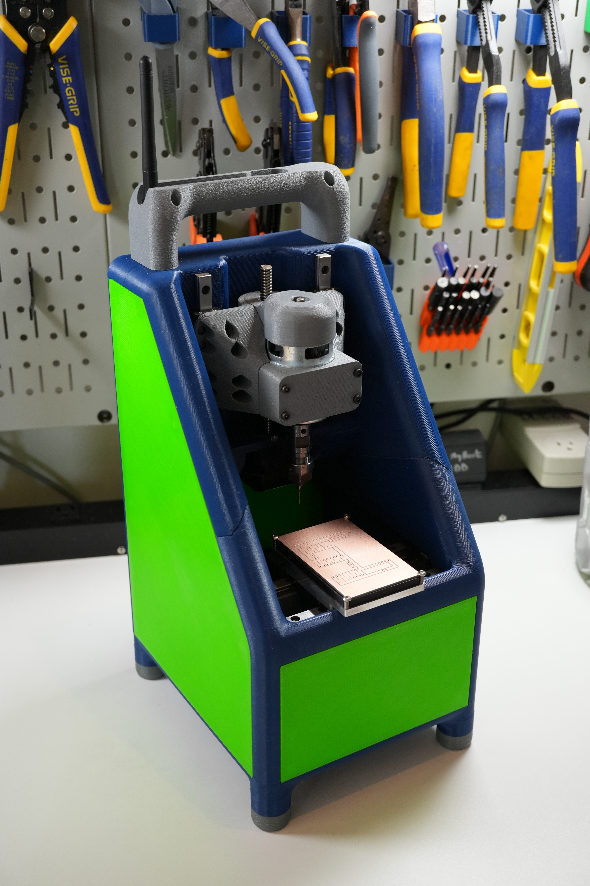
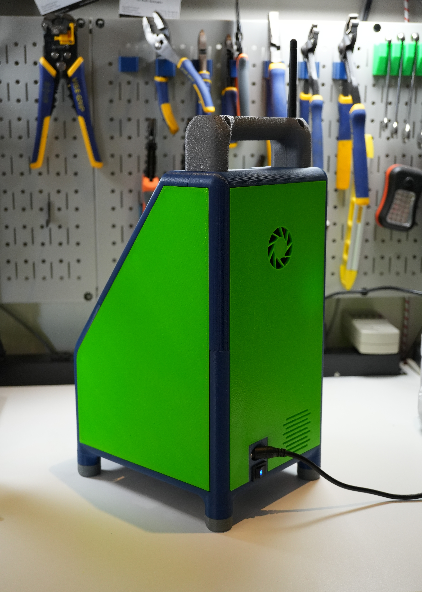

# CoinOp

## CoinOp is a portable 3D printed desktop engraver/mill/cnc

- *This project is a work in progress*
- *Accessories will be added as they are physically validated*
- *Expect files to change*

## Features

- Spindle power and probe logic are transmitted through linear rails/leadscrews (no wires)
- Conductive materials can be probed directly without any user interaction
- Travels conveniently with built-in storage trays for frequently used parts
- 60 x 90mm XY work area (60 x 120mm travel, increased work area with future mods)
- 25mm Z clearance

 
 

## Feeling appreciative?

#### Pay it forward! Consider supporting the SMF!

[Sanjay Mortimer Foundation](https://www.sanjaymortimerfoundation.org/)

[Sanjay Mortimer Foundation PayPal](https://www.paypal.com/donate/?hosted_button_id=VUB6NVF83EH5J)

 
 

 
 

## YouTube Videos

[CoinOp - 3D Printed Open Source CNC - circuit milling & hole drilling, 16x speed](https://youtu.be/r40ErLt8Xys)

